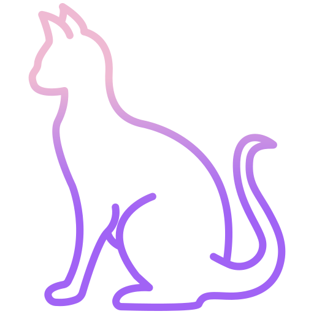

 

# Meowsic

A beautiful, modern, offline music player for **Windows**.

### Download

- **Recommended:** Download and install using the latest installer from [GitHub Releases](https://github.com/CyanFroste/meowsic/releases/latest).

### Main Features

- Play most major music formats
- High performance even with 100,000+ songs
- Manage playlists with drag‑and‑drop ordering
- Search based on music metadata
- Mini player for compact control
- Synchronized Lyrics viewer
- Can add Custom Rules to your tracks
- Export and Import your data

### [Screenshots](./screenshots/index.md)

  

More: [See all screenshots](./screenshots/index.md)

---

### Development

Check the [TODO](./TODO.md) list for upcoming features and fixes.  
Found a bug or have a feature request? Please open an [ISSUE](https://github.com/CyanFroste/meowsic/issues) to get it fixed.  

Made with Rust, Tauri, Typescript and React.  
Thanks to [lrclib.net](https://github.com/tranxuanthang/lrclib) for providing Lyrics API.

### [License](./LICENSE)

Copyright © 2025 Cyan Froste

Meowsic is licensed under the Apache License, Version 2.0.  
See the [LICENSE](./LICENSE) file for more details.
